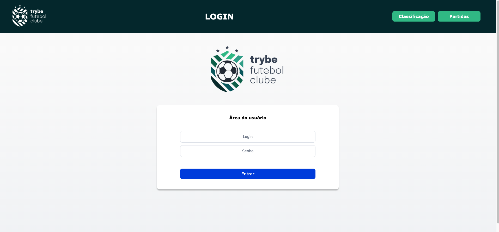

# Soccer Games #



## About ##

It is a FullStack application composed of three services, Front-End, Back-end and database.

The soccer Games application consists of a football schedules ranking table, in which, through user validation via login, it is possible to consult and change match data, insert new matches, finalize ongoing matches, consult the general classification and Classify home schedules and away schedules.

## Stacks ##

### :whale: Docker ###
To ensure that the application would run in a standard way, regardless of the environment, the Docker tool was used to package the application services (Front-End, Back-end and database) in containers (segregation of processes in the same kernel).
These containers were created from an “image” that had its creation defined in the Dockerfile file of each service.

### Front End ###

* Programming language:
  * **JavaScript**
     * Compatibility with most modern browsers;
     * High availability of resources;
         
* Frameworks
  * **React:** JavaScript library used to create dynamic and responsive user interface;
  * **ContextAPI**: to manage the global state of the application;
  * **Axions**: HTTP client based on a simple promise for navegador and node.js, used to make requests transit between the Front and back-End.

## Backend ##

* Programming language:
  * **JavaScript**;
  * **TypeScript**: to add static typing to JavaScript.
     
* JS interpreter outside the browser
  * **Node.js**
    
* Frameworks and libraries
  * **Express**: framework that receives requests and sends responses;
  * **JSonWebToken**: library used to make a token and validate it, ensuring user authentication;
  * **bcrypt**: library used to encrypt passwords;
  * **Chai**: library used to make assertions in application tests;
  * **Sinon**: framework used to mock functions that will be used in application testing;
     
* Principles and concepts
  * API REST
    * **REST**: respects a standard for transferring information, API organized in a way that it serves clients by managing their HTTP requests,              between one request and another, the API does not store client information, repeated requests can be optimized, as they return the same results          and layered system.

  * Software architecture
    * **MSC** (Model-Service-Controller): where the application is separated into 3 layers being the data model, business logic and data presentation.

  * Structuring and organization of the code:
       * **Object Oriented Programming (OOP)**: programming paradigm based on the concept of objects to organize and structure the code in an organized         and scalable way;
       * **SOLID**: set of object-oriented design principles for creating cleaner and more modular code.

  * Database:
       * **MySQL**: relational database management system;
       * **Sequelize**: library used in Node js to do database mapping.

  * Environment variables: to hide access credentials, software behavior settings or other sensitive or relevant information that does not require the        code to be changed.

## Routes ##

1️⃣ User Routes:

* POST /login
  Responsible for registering the login and returning a user token.
* GET /login/validate
  Responsible for validating the login and returning the 'role' of the user.

2️⃣ Team Routes:

* GET /teams
  Responsible for returning teams registered in the DB.
* GET /teams/:id
  Responsible for returning teams registered in the DB through the ID.

3️⃣ Matches Routes:

* GET /matches
  Responsible for returning all matches.
* POST /matches/
  Responsible for registering a match in the DB. -PATCH /matches/:id
  Responsible for updating goas of a specific match
* PATCH /matches/:id/finish
  Responsible for updating the status of a match in progress to a finished match ('inProgress: false') in the DB.

4️⃣ Leader Routes:

* GET /leaderboard
  Responsible for returning the leaders of the championship (indoors or away from home).
* GET /leaderboard/home
  Responsible for returning the league leaders playing at home
* GET /leaderboard/away
  Responsible for returning the league leaders away from home


## Guidelines to runnig API ##

1. Clone the repository: ```git clone git@github.com:carinacunha/soccer-games.git```
2. Navigate to the root of the repository: ```cd soccer-games```
4. Install the dependencies: ```npm install ```
5. Navigate to app/: ```cd app/ ```
6. Initialize the Docker containers: ```npm run compose:up:dev```
7. Navigate to app/: ```cd frontend/ ```
8. Install the dependencies: ```npm install ```
9. Navigate to app/: ```cd backend/ ```
10. Install the dependencies: ```npm install ```
11. Initialize app: ```nmp start```
12. Run tests: ```npm run test```

**✨ This project was developed during the Full Stack Web Development course at Trybe**
